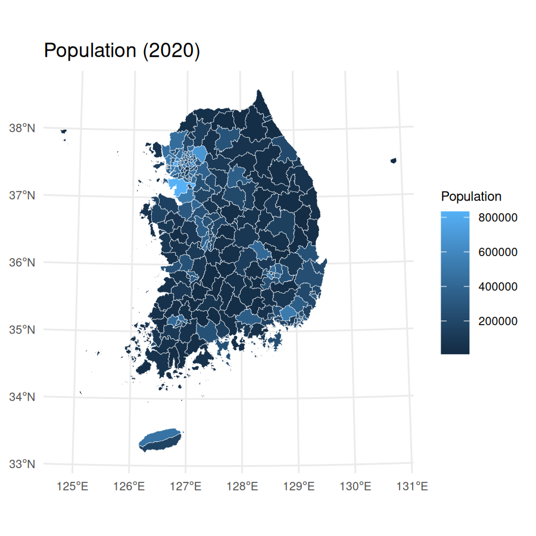
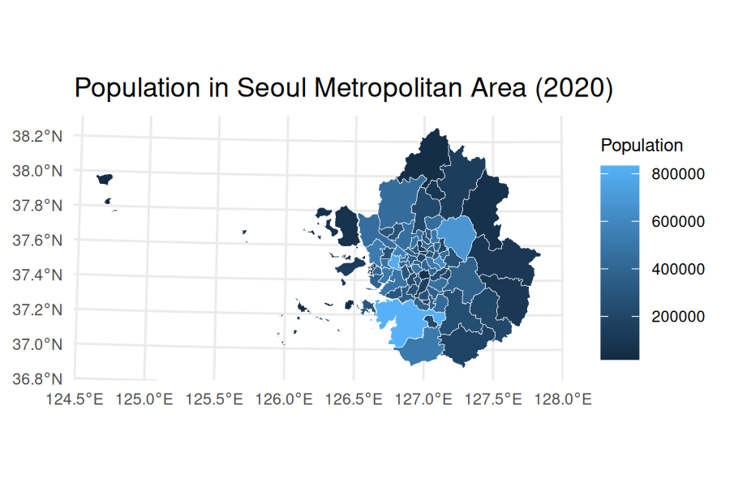

# Who is the package for?

The `tidycensuskr` package is designed for R users who want to work with
South Korean census and administrative boundary data. It aims to provide
an easy-to-use interface for population, housing, and socioeconomic
statistics linked with geospatial boundaries.

<a href='https://sigmafelix.github.io/tidycensuskr/'></a>

# Installation

You can install the released version of `tidycensuskr` from CRAN with:

``` r
# CRAN 
install.packages("tidycensuskr")
```

To install the development version, you will need a GitHub account and
generate a personal access token with `repo` permissions.

``` r
# Development version from GitHub
rlang::check_installed("remotes")
remotes::install_github("sigmafelix/tidycensuskr", auth_token = "__YOUR_GITHUB_TOKEN__")
```

After cloning the repository, you can also install the package using:

``` r
devtools::install(quick = TRUE)
```

# About the data

As of September 2025, this package contains two datasets: Census data
(`censuskor`) and the corresponding geospatial data.

## 1. Census data

- Sigungu dataset of three census years (2010, 2015, 2020)
  - The curated dataset is a **long** table (i.e., one row per
    district-year-variable)

### `anycensus()`

- The function `anycensus()` allows you to query census data for
  specific district or province codes and types of data (population,
  tax, mortality, economy, housing) for three census years (2010, 2015,
  2020).

``` r
# loading Seoul population data
tidycensuskr::anycensus(codes = "Seoul", type = "population")
#> # A tibble: 25 × 9
#>     year adm1  adm1_code adm2          adm2_code type     all households_total…¹
#>    <int> <chr>     <dbl> <chr>             <dbl> <chr>                     <dbl>
#>  1  2020 Seoul        11 Dobong-gu         11100 populat…                 312878
#>  2  2020 Seoul        11 Dongdaemun-gu     11060 populat…                 332796
#>  3  2020 Seoul        11 Dongjak-gu        11200 populat…                 378749
#>  4  2020 Seoul        11 Eunpyeong-gu      11120 populat…                 458777
#>  5  2020 Seoul        11 Gangbuk-gu        11090 populat…                 295304
#>  6  2020 Seoul        11 Gangdong-gu       11250 populat…                 440022
#>  7  2020 Seoul        11 Gangnam-gu        11230 populat…                 509899
#>  8  2020 Seoul        11 Gangseo-gu        11160 populat…                 564114
#>  9  2020 Seoul        11 Geumcheon-gu      11180 populat…                 225594
#> 10  2020 Seoul        11 Guro-gu           11170 populat…                 394733
#> # ℹ 15 more rows
#> # ℹ abbreviated name: ¹​`all households_total_prs`
#> # ℹ 2 more variables: `all households_male_prs` <dbl>,
#> #   `all households_female_prs` <dbl>
```

### `censuskor`

- The function `data(censuskor)` loads an attached dataset that contains
  the census data in long form. This dataset is automatically loaded
  upon loading the package.

## 2. Administrative boundaries

### `load_district()`

- The function `load_district()` allows you to get the *Si-Gun-Gu* level
  `sf` files for the three census years (2010, 2015, 2020).

``` r
# loading boundary sf file
tidycensuskr::load_districts(year = 2020)
#> Simple feature collection with 250 features and 2 fields
#> Geometry type: GEOMETRY
#> Dimension:     XY
#> Bounding box:  xmin: 746111 ymin: 1463977 xmax: 1302469 ymax: 2068441
#> Projected CRS: KGD2002 / Unified CS
#> First 10 features:
#>    year adm2_code                       geometry
#> 1  2020     21140 POLYGON ((1147104 1689056, ...
#> 2  2020     21020 POLYGON ((1137763 1683521, ...
#> 3  2020     21010 POLYGON ((1139121 1678921, ...
#> 4  2020     21040 POLYGON ((1144618 1676795, ...
#> 5  2020     21070 POLYGON ((1142639 1682655, ...
#> 6  2020     21130 POLYGON ((1147030 1688822, ...
#> 7  2020     21050 POLYGON ((1138992 1683338, ...
#> 8  2020     21030 POLYGON ((1142527 1684031, ...
#> 9  2020     21150 POLYGON ((1135430 1690583, ...
#> 10 2020     21100 MULTIPOLYGON (((1132627 167...
```

# Examples

Package vignettes are the first place to look for detailed examples.
Below are some quick examples to get you started.

## Simple map making

`anycensus()` will return an analysis-ready data.frame that can be
easily merged with the corresponding boundary `sf` object from
`load_districts()`. Here is a simple example of making maps with
population data.

``` r
library(tidycensuskr)
#> tidycensuskr 0.1.2 (2025-09-23)
library(ggplot2)
library(dplyr)
#> 
#> Attaching package: 'dplyr'
#> The following objects are masked from 'package:stats':
#> 
#>     filter, lag
#> The following objects are masked from 'package:base':
#> 
#>     intersect, setdiff, setequal, union
library(tidyr)
library(sf)
#> Linking to GEOS 3.12.2, GDAL 3.11.3, PROJ 9.4.1; sf_use_s2() is TRUE
library(biscale)
library(cowplot)
sf_use_s2(FALSE)
#> Spherical geometry (s2) switched off
options(scipen = 100)

# load census data
census_pop_2020 <- anycensus(year = 2020, codes = NULL, type = "population")
#> Using character codes that are convertible to integers. Automatically converting to integers...
census_pop_2020 <- census_pop_2020 |>
  rename(population_total = `all households_total_prs`)

# load boundaries
adm2_2020 <- load_districts(year = 2020)

# merge boundaries and census data
census_2020_sf <- adm2_2020 |>
  left_join(census_pop_2020, by = c("adm2_code" = "adm2_code"))

# plot population data
census_2020_pop <-
  ggplot(census_2020_sf) +
  geom_sf(aes(fill = population_total), color = "white", size = 0.1) +
  theme_minimal() +
  labs(
    title = "Population (2020)",
    fill = "Population"
  ) +
  theme(plot.title = element_text(size = 12))

census_2020_pop
```



For Seoul Metropolitan Area (including Seoul, Incheon, and Gyeonggi-do),
you can use a character vector in `codes` argument and merge the
retrieved `data.frame` and `sf` object with `inner_join()`:

``` r
census_pop_2020_sma <-
  anycensus(
    year = 2020,
    codes = c("Seoul", "Incheon", "Gyeonggi"),
    type = "population"
  ) |>
  rename(population_total = `all households_total_prs`)

census_2020_sf_sma <- adm2_2020 |>
  inner_join(census_pop_2020_sma, by = c("year", "adm2_code"))


# plot population data
census_2020_pop_sma <-
  ggplot(census_2020_sf_sma) +
  geom_sf(aes(fill = population_total), color = "white", size = 0.1) +
  theme_minimal() +
  labs(
    title = "Population in Seoul Metropolitan Area (2020)",
    fill = "Population"
  ) +
  theme(plot.title = element_text(size = 12))

census_2020_pop_sma
```


