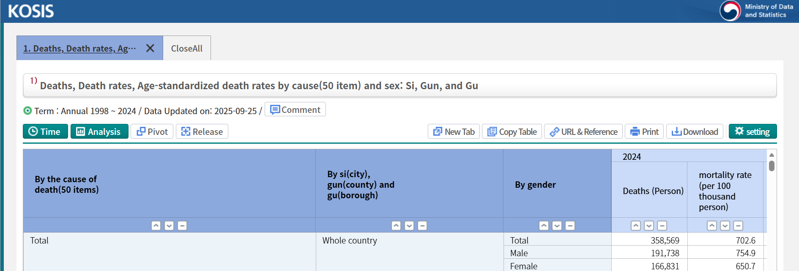
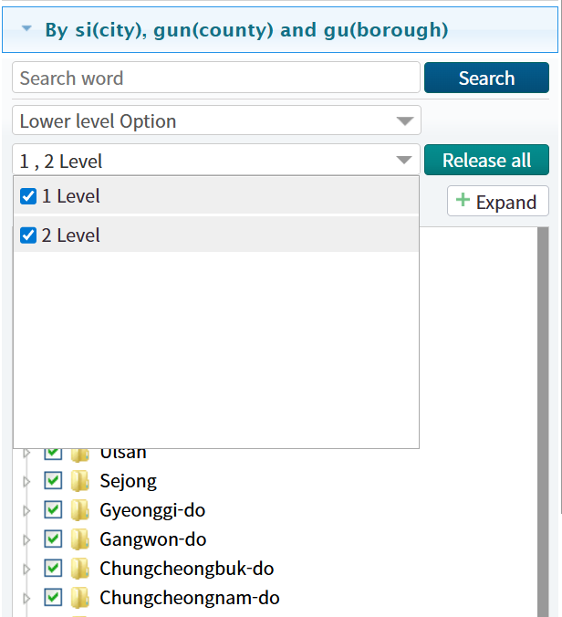
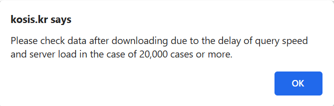
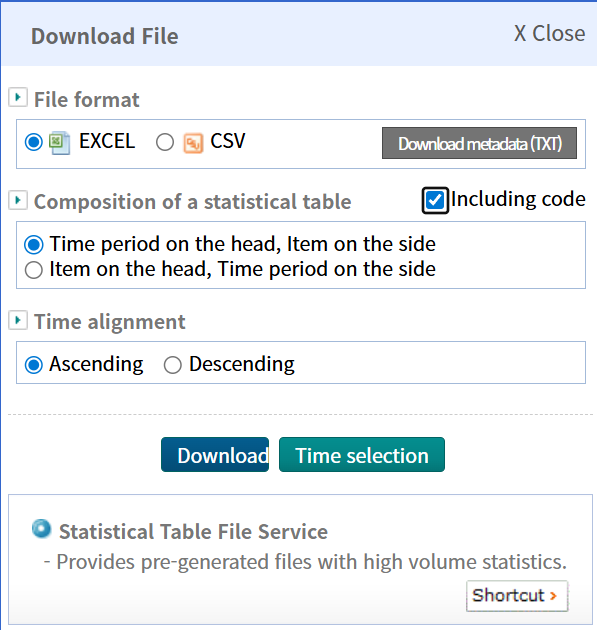
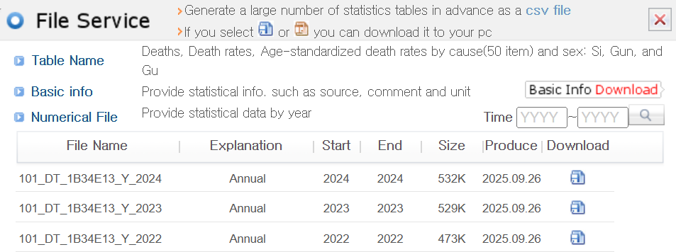

```{r setup, include=FALSE}
knitr::opts_chunk$set(collapse = TRUE,
                      comment = "#>")
```

## Objectives
This vignette provides a guide for contributors on how to effectively use the KOSIS (Korean Statistical Information Service) interface for data retrieval for addition to the package's bundle `censuskor` `data.frame`. In vignette 04, we introduced how KOSIS API is used to retrieve the data of interest using KOSIS' OpenAPI URL. In many cases, it would be handy for users to download data directly from KOSIS web pages. By the end of this guide, contributors will be able to:

1. Navigate the KOSIS interface to locate relevant datasets.
2. Familiarize themselves with various data download options available on KOSIS platform.
3. Extract and format data for inclusion in the package.

## Navigating KOSIS Interface
To begin, visit the KOSIS website at [KOSIS](https://kosis.kr/eng/). Use the search bar or browse through categories to find datasets relevant to your area of interest. Since `tidycensuskr` offers data at _Si_ (city), _Gun_ (county), and _Gu_ (borough) levels, you could type "Si, Gun, Gu" in the search bar to query the list of datasets available. As of November 20, 2025, there are 11 datasets available with that keyword. If you press one of the datasets in the list, you will be directed to the new window with the dataset navigation tool. Below shows the screen capture of the KOSIS interface for the dataset "Deaths, Death rates, Age-standardized death rates by cause(50 item) and sex: Si, Gun, and Gu".

{width=100%}


## Setting Download Options

The default view will show a selected set of variables or _Si_-_Gun_-_Gu_ regions. You can customize the selection by clicking on the "Setting" button on the rightmost side of the toolbar. It will prompt a sidebar where you can select the variables of interest, years, and regions. To select all _Si_-_Gun_-_Gu_ regions, click on the "Level 2 Selection" button under the "Region" tab. It will activate all checkboxes for _Si_-_Gun_-_Gu_ regions. Note that the "Level 1 Selection" button only selects _Si_ (city/province) level regions, which is default for many datasets. Another to note is that some single-district cities like Sejong are sometimes not listed under "Level 2 Selection." In this case, you need to manually check the box for such regions.



### Notes on Size Restriction

Choice of an extended number of combinations results in too large queries to handle for KOSIS servers, which is prohibited by KOSIS settings. The default setting is 20,000 cells in one query instance. You might encounter an error message like the screen capture below.




To avoid this issue, try to limit the number of selected years or variables. For example, if you are interested in only the most recent year, deselect all other years except for the latest one. Similarly, if you are only interested in a subset of variables, deselect the rest. This will lead to many separate files to download, requiring further postprocessing steps to combine these files into one for cleaning.

## Downloading Data
Once you have set your desired options, click the "Download" button at the top right of the sidebar. You will see a popup in the center of the screen with download format options. Most of the datasets support Excel Worksheet (.xls) and Comma-separated values (.csv) formats, for some smaller datasets, additional formats like SAS or modern Excel Worksheet (.xlsx) are also available.



It is very important to select "Including code" checkbox at the middle of the popup. This option ensures that the downloaded data includes the necessary statistical codes for regions and variables, which are essential for proper data merging and analysis. For metadata information, you can download a text metadata file by clicking "Download metadata (TXT)" button.

Oft-used datasets are pre-generated and stored on KOSIS servers for quick access. In this case, you will see an additional section in the popup named "Statistical Table File Service," under which a "Shortcut" button is available. Another popup window will appear, providing a list of direct download links for pre-generated files. These files are typically provided by year with auxiliary variables for records.




## Post-processing Downloaded Data
After downloading the data files, you may need to perform some post-processing steps to clean and format the data for inclusion in the package. This may involve:

1. Reading the data into R using appropriate functions (e.g., `read.csv()` for CSV files or `readxl::read_excel()` for Excel files).
2. Renaming columns to match the naming conventions used in the package.

Standard column names include `adm1`, `adm1_code`, `adm2`, `adm2_code`, `year`, `type`, `class1`, `class2`, `value`, and `unit`.

| Column name | Description                                  |
|-------------|----------------------------------------------|
| adm1        | _Si-Do_ (province) level administrative unit name |
| adm1_code   | _Si-Do_ (province) level administrative unit code |
| adm2        | _Si-Gun-Gu_ (district) level administrative unit name |
| adm2_code   | _Si-Gun-Gu_ (district) level administrative unit code |
| year        | Year of the dataset                          |
| type        | Data type (e.g., population, economy)       |
| class1      | First classification level                   |
| class2      | Second classification level                  |
| value       | Measured value                               |
| unit        | Unit of measurement                          |

3. Converting data types as necessary (e.g., ensuring numeric columns are of type `numeric`).
4. Merging multiple files if the data was downloaded in parts due to size restrictions.
5. Validating the data to ensure accuracy and completeness.
6. Appending the cleaned data to `censuskor` and register the dataset in the bundled dataset (i.e., `usethis::use_data(censuskor, overwrite = TRUE)`).

### Assigning Proper `adm2_code`

KOSIS cleaning requires special attention to ensure that the `adm2_code` values are correctly assigned. The `adm2_code` is a unique identifier for each _Si-Gun-Gu_ (district) level administrative unit in South Korea. It is crucial for linking census data to spatial boundary files. We provide a reference table for `adm2_code` values in the package, namely in `extdata/lookup_district_code.csv` in the package installation directory or `inst/extdata/lookup_district_code.csv` if you cloned the GitHub repository. The lookup table contains the following columns:


| Column name | Description                                  |
|-------------|----------------------------------------------|
| sido_kr     | Province name in Korean                      |
| sigungu_kr  | District name in Korean                      |
| sigungu_1_kr| Alternative district name in Korean         |
| sigungu_2_kr| Alternative district name in Korean         |
| sido_en     | Province name in English                     |
| sigun_en    | District name in English                     |
| sigungu_1_en| Alternative district name in English        |
| sigungu_2_en| Alternative district name in English        |
| sdsgg_en    | Combined province and district name in English |
| base_year   | Base year for the code                       |
| tax_exclude | Indicator for tax exclusion                  |
| adm2_code   | Official _Si-Gun-Gu_ (district) level administrative unit code |
| adm2_code_new | New _Si-Gun-Gu_ (district) level administrative unit code |
| sgg_population | District code for population data                 |
| sgg_housing | District code for housing data      |
| sgg_tax_global | District code for global tax data         |
| sgg_tax_income | District code for income tax data        |
| sigungu_doj | District code for Ministry of Justice data (i.e., marital migrants)   |
| sigungu_dcee | District code for Ministry of Climate, Energy, and Environment (i.e., wastewater data) |

To note, `sigungu_kr`, `sigungu_1_kr`, and `sigungu_2_kr` columns provide many versions of district names in Korean with or without the name of basic local governments (기초지방자치단체, upper unit of each district):

- `sigungu_kr`: Standard district name **with** basic local governments for _non-_autonomous districts (e.g., "Ilsandong-gu, Goyang-si" ("고양시 일산동구"))
- `sigungu_1_kr`: Name of basic local governments (e.g., "고양시" in all of "덕양구", "일산동구", and "일산서구") filled in for _non-_autonomous districts
- `sigungu_2_kr`: Standard district name **without** basic local governments for _non-_autonomous districts (e.g., "Ilsandong-gu" ("일산동구"))


This data can be expanded upon addition of new datasets that use different district code systems. For contributors, the target code is to assign is usually `adm2_code` field values. Depending on the retrieved data file's layout, contributors need to match the district names or other code systems to the `adm2_code` values in the lookup table. We reflected the district changes over years by including the `base_year` column in the lookup table. When joining the lookup table to the post-processed data, use the code or name columns **and** the `base_year` column to ensure accurate matching.

It is extremely important to note that year matching should be done with care. The `base_year` column indicates the year when the corresponding `adm2_code` was valid. When joining, ensure that the `year` column in your post-processed data is **less than or equal** to the `base_year` in the lookup table. This ensures that you are using the correct `adm2_code` for the specific year of your dataset.


### Example Code for Post-processing
Here are example code snippets demonstrating how to read a downloaded CSV file, clean it, and assign proper `adm2_code` values:


1. Using Korean district name and `base_year` to join:

Assume that the post-processed data includes `adm2kr` (district name in Korean) and `year` columns.

```r
library(dplyr)

# fixed path to the lookup table
lookup_path <- system.file("extdata/lookup_district_code.csv", package = "tidycensuskr")
lookup_district_code <- read.csv(lookup_path)

# Read the postprocessed CSV file
pratedata <- read.csv("path/to/downloaded_file.csv")

joinby <- dplyr::join_by(
  adm2kr == sigungu_2_kr,
  year <= base_year
)

# join with lookup table to assign adm2_code
cleaned_data <- pratedata |>
  dplyr::left_join(
    lookup_district_code,
    by = joinby
  )
```

2. Using alternative district code (e.g., `sgg_population`) and `base_year` to join:

Let's say the post-processed data includes `sggcd` (alternative district code for Ministry of Justice data) and `year` columns.

```r
library(dplyr)

# fixed path to the lookup table
lookup_path <- system.file("extdata/lookup_district_code.csv", package = "tidycensuskr")
lookup_district_code <- read.csv(lookup_path)

# Read the postprocessed CSV file
dojdata <- read.csv("path/to/downloaded_file.csv")

joinby <- dplyr::join_by(
  sggcd == sigungu_doj,
  year <= base_year
)

# join with lookup table to assign adm2_code
cleaned_data <- dojdata |>
  dplyr::left_join(
    lookup_district_code,
    by = joinby
  )
```
